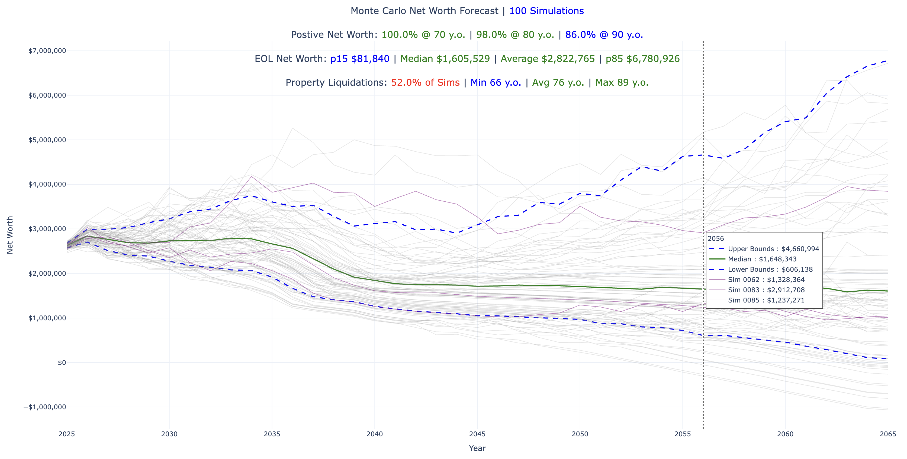
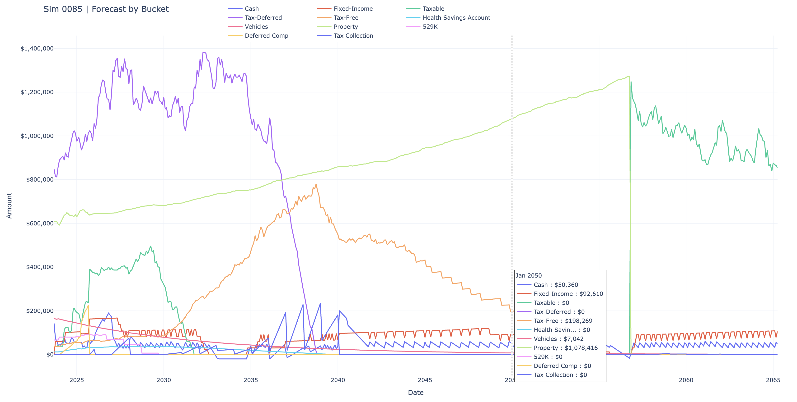

# 🕊️ Nomad Wealth: Policy-Driven Financial Freedom

Nomad Wealth is a policy-driven Python framework that acts as a complete engine for Monte Carlo simulation of your financial future. It starts with your historical data to seed an auditable, bucket-level model, then applies your explicit, configurable rules—covering everything from cash flow triggers to tax-optimized withdrawals—along with inflation-aware market returns. By projecting thousands of possible futures, it transforms complex simulations into clear, actionable insights for achieving and maintaining financial freedom.

---

## 🔍 What Can Nomad Wealth Help Me Discover?

This framework moves your financial outlook beyond simple spreadsheets and generic rules. By embracing the complexity of **real-world market volatility, inflation, and taxes**, Nomad Wealth provides clear, auditable answers to your most critical financial questions:

### Resillience & Sufficiency

- **How likely is my current plan to fail?** It quantifies the probability of running out of money under thousands of volatile market scenarios, giving you a scientific success rate, not just a hope.
- **What is my true maximum sustainable spending limit?** It calculates the highest spending rate you can afford in retirement while maintaining a user-defined risk tolerance (e.g., less than a 5% chance of failure), adjusted for inflation.
- **What specific policy changes are required to survive a major market downturn?** You can test aggressive bear markets to see exactly where and when your cash flow policies break down.

### Strategy & Optimization

- **How does my asset allocation impact my long-term security?** By comparing simulations, you can determine which portfolio mix provides the best risk-adjusted net worth over decades.
- **What is the optimal withdrawal order for my accounts (Roth, Taxable, 401k)?** The sophisticated tax engine provides auditable insight into the tax drag of various withdrawal policies, guiding you to a strategy that maximizes purchasing power.
- **When should I liquidate specific assets (like a home or business) to ensure financial stability?** You can model specific liquidation triggers to see the exact conditions and scenarios that necessitate the sale of a major asset.

### Control & Transparency

- **Where is every dollar going in every possible future?** The auditable bucket model provides unparalleled transparency, allowing you to trace simulated cash flow and account balances to verify and trust every projection.
- **Are my stated financial _policies_ fully documented and understood?** It forces you to explicitly define every financial decision in declarative JSON, ensuring your strategy is transparent, repeatable, and easily shared with an advisor.

---

## 🏛️ Framework Pillars (Technical Detail)

### Move Beyond Simple Averages for True Financial Resilience

Traditional forecasting relies on single-point estimates or historical averages that gloss over real-world volatility and uncertainty. This framework embraces the inherent stochastic nature of markets and cash flows through Monte Carlo simulation, providing you with a full distribution of possible outcomes. You gain confidence in your plan's ability to withstand worst-case scenarios, not just the best or average.

### Financial Planning Driven by Your Rules, Not Only Assumptions

Its policy-first architecture is a game-changer. Instead of hardcoding generic rules, you explicitly define all critical financial decisions—from monthly cash-flow triggers and bucket refill strategies to withdrawal order and liquidation thresholds—in declarative JSON. This makes your plan fully transparent, repeatable, and adaptable as your life circumstances or tax laws change.

### Accurate Projections through Inflation and Tax Reality

By incorporating inflation-adjusted gain sampling and a sophisticated tax engine that models capital gains, income tax, and specific withdrawal penalties, the framework paints a far more realistic picture of future net worth and sustainable withdrawal rates. You get projections based on real purchasing power, avoiding the pitfalls of over-optimistic nominal returns.

### Gain Deep, Auditable Insight into Every Future Dollar

The core auditable, bucket-level transaction engine provides unparalleled transparency. You can trace every simulated dollar in and out of specific accounts (e.g., Taxable, Roth, 401k), offering a clear, scientific basis for optimizing asset location and withdrawal strategies. This moves your planning from a black box to a fully verifiable, strategic model.

---

## 🔧 Features

- Fixed and recurring transaction ingestion from CSV
- Inflation-aware market return simulation via user-defined gain tables
- Threshold-driven refill policies with retirement-age gating to avoid penalties
- Configurable emergency liquidation hierarchy across buckets
- Automated recurring rental transactions after property liquidation event
- Tax-aware withdrawals distinguishing ordinary income, capital gains, and penalties
- Independent Roth conversion scheduling
- Monte Carlo sampling with percentile bands and probability metrics
- Interactive Plotly visualizations and CSV exports of net worth, bucket balances, and tax breakdowns

### Monte Carlo Net Worth Forecast Example



### Sample Simulation Forecast by Bucket Example



---

## 🚀 Quick Start

1. Clone repo:

   ```bash
   git clone https://github.com/emb417/nomad-wealth
   ```

   - use a virtual environment to install dependencies.
   - Or install dependencies manually:

   ```bash
   cd nomad-wealth
   pip install -r requirements.txt
   ```

2. Configure profiles and policies in `config/` (see [`config/README.md`](config/README.md))
3. Supply historical balances and transactions in `data/` (see [`data/README.md`](data/README.md))
4. Adjust constants in `src/app.py`:
   - `SIMS` : the number of simulations, more simulations = more accuracy
   - `SIMS_SAMPLES` : a random number of simulations selected for inspection and exporting
   - `SHOW_HISTORICAL_NW_CHART`, `SAVE_HISTORICAL_NW_CHART` : show and save the historical networth chart including monthly gain/loss %
   - `SHOW_NETWORTH_CHART`, `SAVE_NETWORTH_CHART` : show and save the main networth chart
   - `SHOW_SIMS_SAMPLES`, `SAVE_SIMS_SAMPLES` : show and save the randomly selected sample simulations to see forecasts by bucket
5. Run the simulation:

   ```bash
   python src/app.py
   ```

---

## 📁 Folder Structure

| Folder    | Description                                                            |
| --------- | ---------------------------------------------------------------------- |
| `config/` | JSON definitions for buckets, thresholds, gain tables, inflation rules |
| `data/`   | CSVs for historical balances and transactions                          |
| `src/`    | Application code (see [`src/README.md`](src/README.md))                |
| `export/` | Outputs: Monte Carlo charts, sample forecasts, tax records             |

---

## 📈 Outputs

- `mc_networth_<timestamp>.html`: Monte Carlo net worth chart with percentile lines and probability metrics
- `####_buckets_forecast_<timestamp>.csv`: Bucket balance trajectories for sampled simulations
- `####_taxes_forecast_<timestamp>.csv`: Year-end tax breakdowns
- `####_buckets_forecast_<timestamp>.html`: Interactive bucket balance visualizations
- `historical_nw_<timestamp>.html`: Historical net worth and gain/loss chart

See [`export/README.md`](export/README.md) for details.

---

## 🧠 Simulation Logic

Each month the engine sequentially applies:

1. Core transactions (fixed, recurring, rental, salary, SS, Roth)
2. Threshold-based refills (age-gated for tax-deferred sources)
3. Market returns via inflation-aware gain sampling
4. Emergency liquidation when cash falls below threshold, bypassing age-gating if needed (i.e. tax-penalized)
5. Monthly tax drip and tax collection
6. Balance snapshot and tax aggregation
7. January year-end tax payment and penalty integration

---

## 🛣️ Roadmap

- Visualize historical bucket balances using line (balance) and bar (periodic gains) charts
- Visualize annual income sources using stacked bar chart
- Visualize annual expenses using stacked bar chart
- Visualize comparison of income to expenses
- Visualize cash flows using multi-level sankey chart
- Visualize tax liabilities per year per bucket
- UI to enter balances and manage individual accounts and assign them to buckets
- UI for tuning configurations: profile, holdings, gains, inflation, policies
- UI for managing future transactions: fixed and recurring
- UI for managing income sources: unemployement, salary, bonuses, social security
- Handle Required Minimium Distributions programatically instead of using date-based policy with static amounts
- Handle Health Savings Account spending programatically, instead of using date-based recurring transactions
- Handle unemployment and delayed salary expectations
- Handle self-employment taxes
- Handle self and spousal IRA contributions
- Handle specified equities with current market values and forecasted gains
- Support various vesting schedules and maturity dates
- Scenario tagging and multi-profile support
- Interactive forecast comparison across scenarios
- Support "smile" expenses curve
- Category-specific inflation for expenses

---
