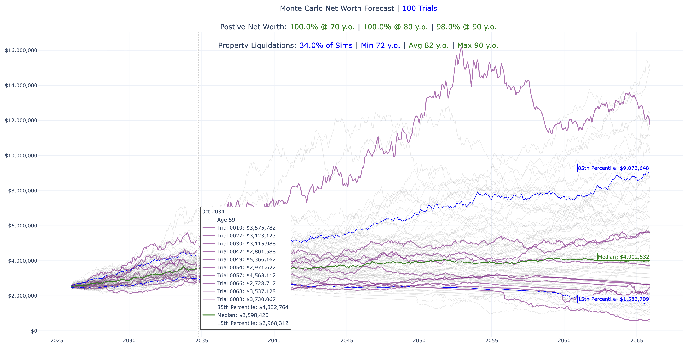
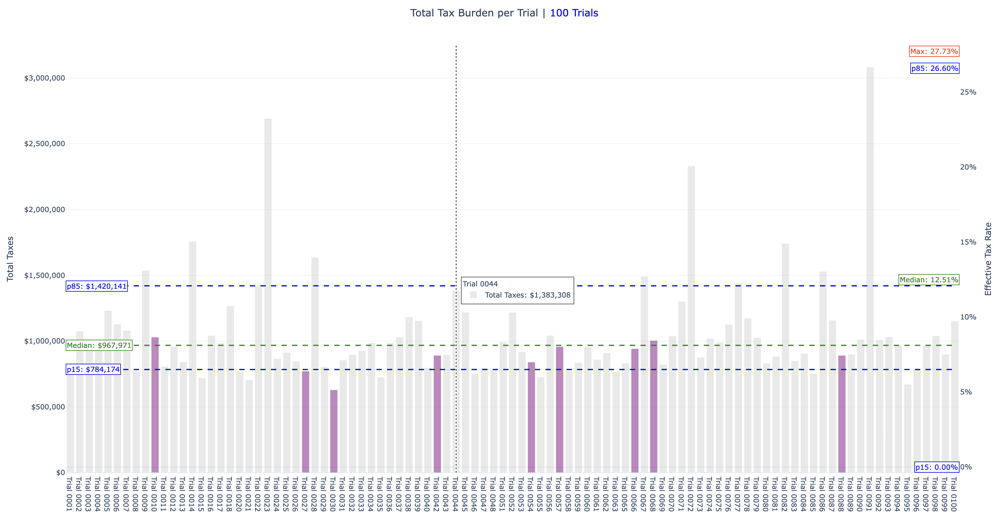
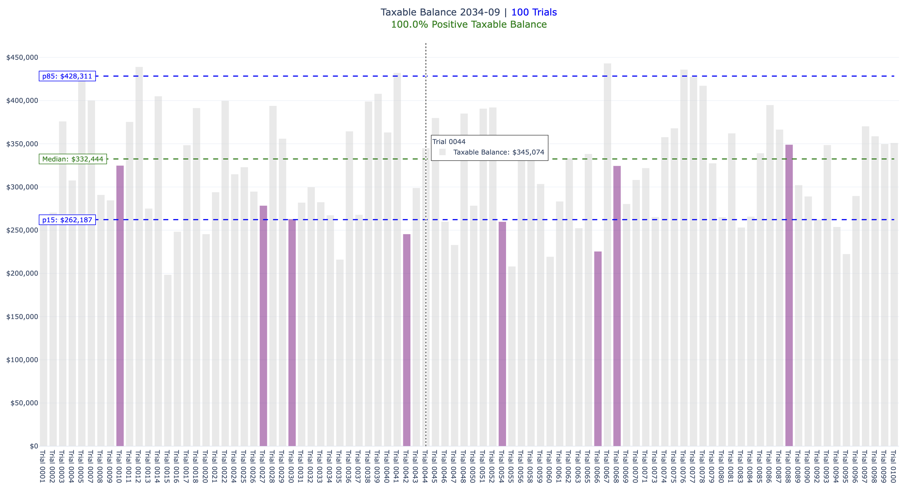
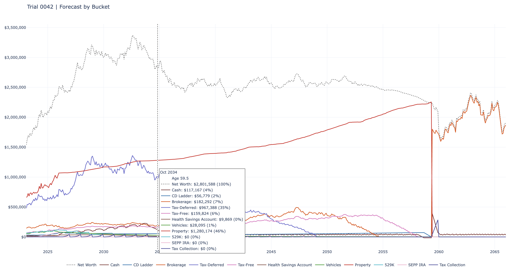
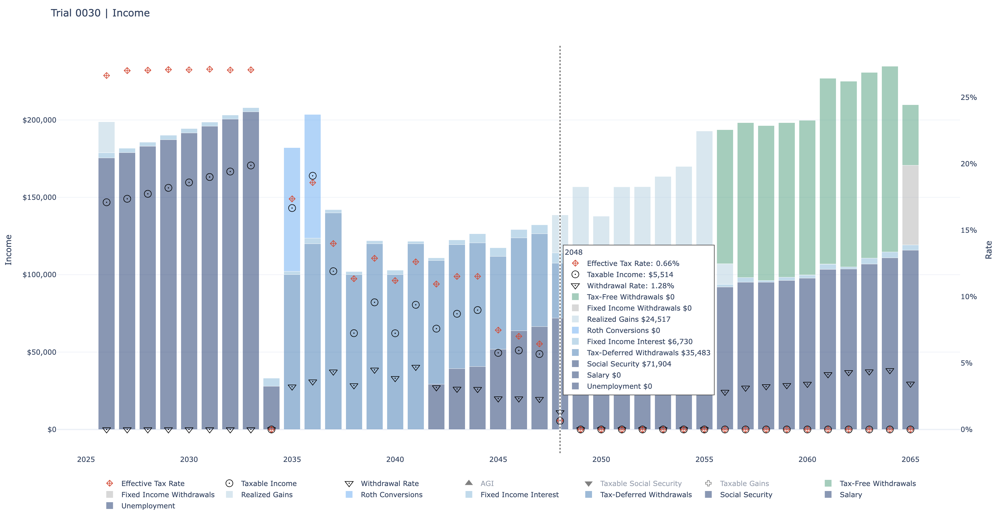
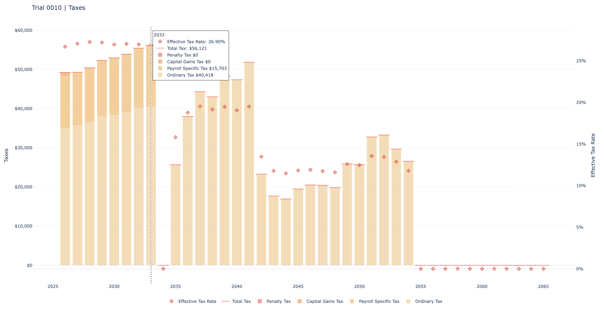
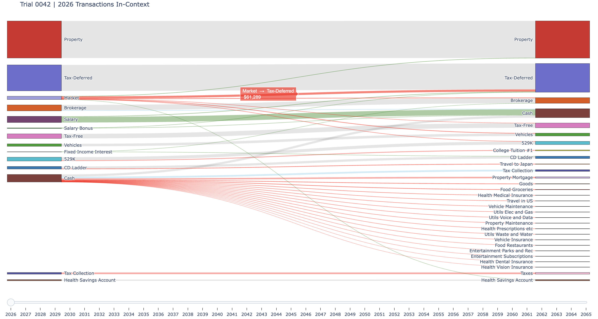
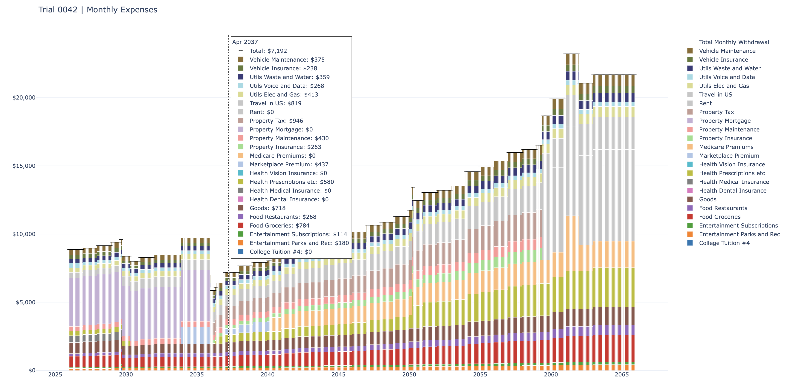
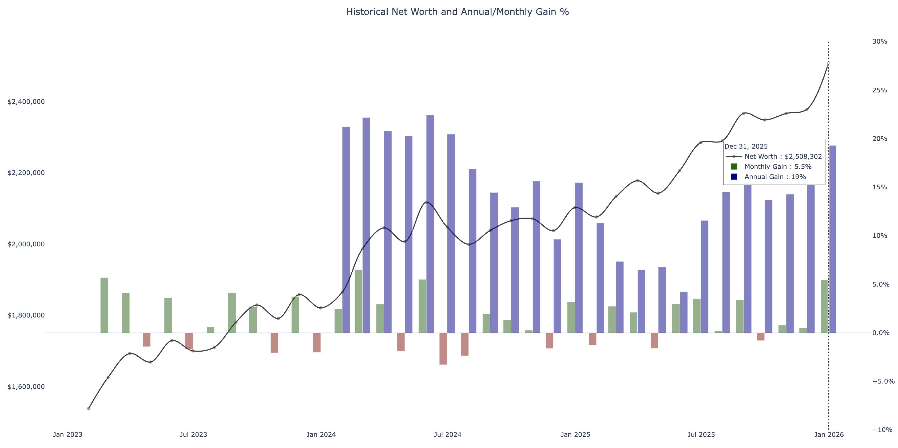

# 📊 Visualization Guide  

Nomad Wealth includes a visualization layer that generates interactive Plotly charts and CSV exports.  
These charts turn complex simulations into **clear, intuitive visuals** that help you understand your retirement outlook, spot risks, and build confidence in your plan.  

---

## 🎲 Monte Carlo Charts  

Monte Carlo charts summarize results across all trials, showing probabilities and ranges:  

### `plot_mc_networth()`  

  

- **Purpose:** Net worth distribution with median trajectory and 15th/85th percentile bands.  
- **Why it matters:** Shows whether your plan is likely to be sufficient, and highlights risk bounds.  

### `plot_mc_totals_and_rates()`  

  
  

- **Purpose:** Total taxes and withdrawal rates across trials.  
- **Why it matters:** Helps you see the tax burden and whether withdrawals remain sustainable.  

### `plot_mc_taxable_balances()`  

  

- **Purpose:** Taxable balances at SEPP end month.  
- **Why it matters:** Highlights liquidity available in taxable accounts at critical milestones.  

### `plot_mc_monthly_returns()`  

  
  
  

- **Purpose:** Distribution of monthly returns for property, fixed income, and stocks.  
- **Why it matters:** Shows volatility and variability, helping you understand how markets affect your plan.  

---

## 🧾 Example Trial Charts  

Example trial charts show what a single simulation looks like in detail:  

### `plot_example_forecast()`  

  

- **Purpose:** Forecasted account balances over time.  
- **Why it matters:** Shows how your assets evolve and whether they last through retirement.  

### `plot_example_income_taxes()`  

  
  

- **Purpose:** Annual income and tax breakdowns.  
- **Why it matters:** Clarifies how income sources and withdrawals translate into taxes.  

### `plot_example_transactions_in_context()`  

  

- **Purpose:** Transactions shown alongside account balances.  
- **Why it matters:** Provides context for how spending and inflows affect your overall plan.  

### `plot_example_transactions()`  

  

- **Purpose:** Transactions for a given year.  
- **Why it matters:** Useful for tracing specific flows and verifying assumptions.  

### `plot_example_monthly_expenses()`  

  

- **Purpose:** Monthly expenses over time.  
- **Why it matters:** Helps identify spending patterns and see how healthcare costs (Medicare, IRMAA) affect your budget.  

---

## 📜 Historical Charts  

Historical charts provide context by showing past performance:  

### `plot_historical_bucket_gains()`  

  

- **Purpose:** Monthly gain/loss trends for each account.  
- **Why it matters:** Highlights which assets contributed most to changes in net worth.  

### `plot_historical_balance()`  

  

- **Purpose:** Net worth trajectory with gains/losses.  
- **Why it matters:** Provides a clear view of overall financial progress over time.  

---

## ⚙️ Flags & Modes  

- **`SHOW_*` flags** → control whether charts are displayed interactively.  
- **`SAVE_*` flags** → control whether charts are exported to HTML/CSV.  
- **`DETAILED_MODE`** → enables full transparency with additional charts and context.  

---

## 📝 Visualization Notes  

Nomad Wealth’s charts are designed for **clarity and reproducibility**:  

- Consistent labels, colors, and formatting across all charts.  
- Percentile overlays (p15, median, p85) make scenario comparisons easy.  
- Dual y‑axes show both dollar values and percentage rates where relevant.  
- CSV/HTML exports preserve interactive and tabular views for sharing or review.  
- Logging ensures every chart export is traceable.  

**Specialized charts:**  

- **Sankey diagrams** → visualize flows between accounts, showing deposits, withdrawals, transfers, gains, and losses.  
- **Transactions in context** → align flows with balances for transparency.  
- **Forecast charts** → show account‑level visibility, net worth trajectory, and age overlays.  
- **Monte Carlo charts** → highlight retirement probabilities, tax burdens, withdrawal sustainability, and account liquidity.  

---

## 📚 Related Pages  

- [Usage Guide](usage.md) → explains workflow and output files  
- [Architecture Overview](architecture.md) → system design and visualization integration  
- [Simulation Logic](simulation_logic.md) → monthly loop and aggregation steps  
